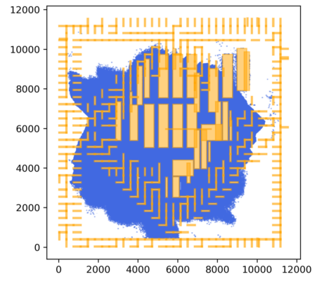
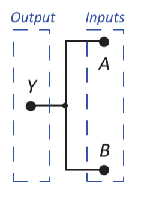
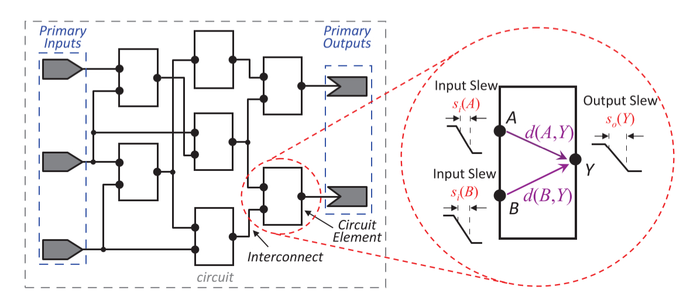
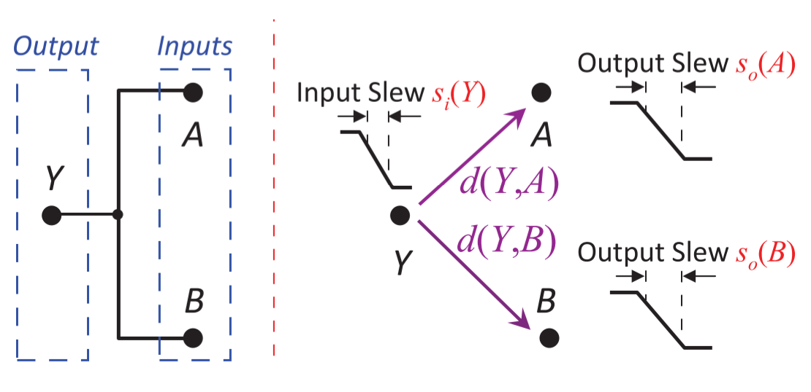
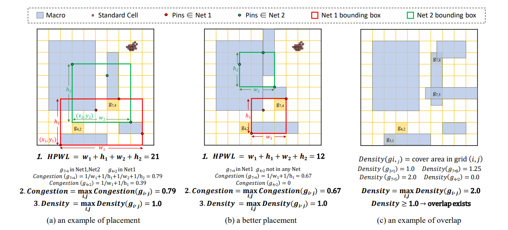

# Terminology
- design
  - 一般指的就是一个电路，比如其Verilog文件
- macro
  - 一般翻译为宏元件，比较大，比一些逻辑门等等大很多
  - 一般建模为矩形，但是也有其他不标准的形状
  - macro也是有引脚的，可以和其他cell或者macro相连，参与到电路图的构成中
  - 在一些比较大的电路中，可能有1000个左右的macro
- cell
  - 一般也称为standard cell、logic gate
  - 如AND（与门）、NAND（与非门）、XOR（异或门）等等
  - cell有若干引脚，输入引脚和输出引脚
  - cell一般也是建模为矩形，但是和macro相比就非常小的
  - 比较大的电路中，cell的数量是很多的，一般有十万级或者百万级
  - 
  - 如上图，黄色的块就是macro，蓝色的密密麻麻的小点就是cell
- fanin & fanout
  - fanin指的是cell的输入引脚
  - fanout指的是cell的输出引脚
- net
  - 网，同时也称为wire，连接了不同的pin
  - 如果将电路图建模为超图(hyper graph)，则超图中的边，就叫做net，当然也可以称为edge
  - net可以连接多个pin，不止两个
  - 在Verilog文件中，net就是wire，可以观察到wire首先连接一个fanout，然后再连接很多fanin，这个fanout称为驱动源(net driver)，这些被连接的fanin称为net sink，信号就是从driver指向sink
  - 通常情况下，一个net只有一个driver，极少情况也有特例
  - 可以理解为，net将信号从fanout/driver传递到fanin/sink
  - 因为net连接了不同cell，因此成为interconnection
  - 
  - 如上图就是一个net的例子，从cell的output pin指向其他cell的input pins
- netlist
  - 网表
  - 一般就是指一个电路图
- AIG
  - AND-Invertor-Graph
  - 因为对于一个电路来说，只有NAND这个门，就可以把其他的cell全部表示出来了，因此在逻辑综合阶段，可以借助开源工具ABC，将一个Verilog文件表示的电路，用AND和Invertor完全表示出来
  - Invertor表示反相器
- port
  - 端口
  - 在Verilog文件中，顶层模块(top module)和外界交互的引脚，称为端口
  - 对于顶层模块的输入端口，又叫primary input (PI)
  - 对于顶层模块的输出端口，又叫primary output (PO)
- cell delay
  - 对于一个cell，信号从fanin传递到fanout需要时间，这段时间称为cell delay
  - 一般来说，每一对fanin-fanout之间都有cell delay
- slew
  - 对于一个pin，信号从低电平变到高电平，或者高电平变到低电平，需要一定时间
  - 这段时间称为slew
  - 
- net delay
  - 同理，对于一个net，信号从net driver传递到net sink也需要时间，这段时间称为net delay
  - 
- timing arc
  - 时序弧
  - 其实就是指cell delay和net delay对应的信号传播模型
- Arrival Time (AT) & Required Arrival Time (RAT)
  - 电路中存在延迟，因此信号传递到每个pin都有一个时间
  - 将电路建模为一个AOE网络(Activity On Edge)，从源点开始，计算每个节点的最早开始时间，就是AT，同理，从汇点开始，计算每个节点的最晚开始时间，就是RAT，可以去看一下数据结构中的最早开始时间和最晚开始时间
  - 详细的AT和RAT计算，可以参考：**TAU 2014 Contest on Removing Common Path Pessimism during Timing Analysis**
  - 对于时序逻辑电路，还会更复杂一些，可以参考[https://zhuanlan.zhihu.com/p/278523793](https://zhuanlan.zhihu.com/p/278523793)
- LUT
  - Look Up Table
  - 这个和逻辑综合里面的不太一样，这里指的是cell中的查找表
  - 对于一个cell的fanout，可以通过这种方法求它的cell delay和output slew
  - 本质上，可以将电路图的物理电路图建立，然后代入电容电阻来求，但是这样太麻烦了，就引入了LUT这种空间换时间的方法，对于一个fanin-fanout，给出fanin的slew和fanout的driving/output capacitance，可以在这个2D的表格中直接查找，要是查不到就用双线性插值，也就是这个2D表格的两列索引，分别是input slew和driving capacitance，表格中的值就是cell delay或者output slew
  - 更详细的介绍可以参考：**TAU 2015 Contest on Incremental Timing Analysis**
- bounding box
  - 对于一个net，用一个最小的矩形框把它连接的pin全都框住
  - 
  - 更详细的举例：**MaskPlace: Fast Chip Placement via Reinforced Visual Representation Learning**
- HPWL
  - Half-Perimeter Wire Length，半周长线长
  - 对于一个net，求其bounding box的半周长，作为HPWL
  - 一般用这个来替代真实的线长，作为一个proxy wirelength，好处就是计算速度很快
- two-pin net
  - 前面提到，一个net一般来说由1个driver和若干个sink组成，因此可以将这个net进行分解，这1个driver和其他每个sink组队，得到若干two-pin net
  - 一般这种方法在传统的布线器中用的比较多
- RUDY
  - 用来衡量routing（布线）的metric，衡量拥塞（congestion）的指标
  - 更加详细的介绍：**Fast and Accurate Routing Demand Estimation for Efficient Routability-driven Placement**
  - 或者单纯看看怎么计算：**MaskPlace: Fast Chip Placement via Reinforced Visual Representation Learning**，看看这篇文章的附录，这篇文章虽然是从强化学习来做macro placement的，但是细节全给了，也介绍了很多AI4EDA的基本概念，很推荐读一读
  - 这两种RUDY其实有点不一样，但是都可以用来近似衡量routing阶段的拥塞（congestion）